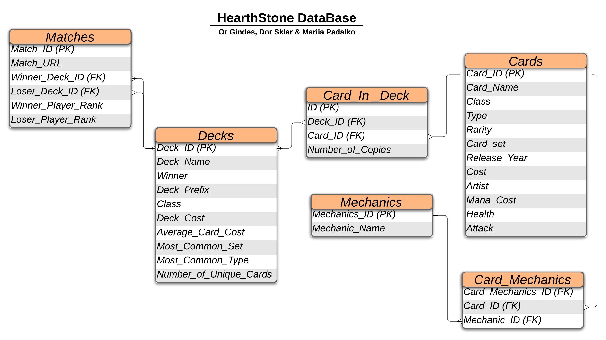

# ITC -  Data Science and Machine Learning Cohort

## Data Mining Project by Or Gindes, Dor Sklar & Mariia Padalko

### Table of Contents 

* Intro
* What is the project about ?
* What questions do we want answers for ?
* Where do we go to, then ?
* Database creation
* Challenges
* Insights and conclusions
* Additional Sources of information
* Appendix
    * Current status
    * Technologies
    * Setting up your project folder and environment
    * User manual

### Intro 

This project is a part of the ITC Data Science and Machine Learning Cohort. 
The project revolves around Data Mining, a task that Data Scientists often have to do. 
The Data Mining technique which will be used in this project is web scraping which is a common
Data Mining technique used to extract data from websites. 
This README document will serve 2 goals:
1. This document's main part tells the whole story behind the project. 
2. The appendix provides the technical aspect of the project, including a complete manual on how to run it.


### What is the project about ? 

This project revolves around Hearthstone. 
Hearthstone is a digital turn-based card game published in 2014 and supporting an estimated 100+ Million active players worldwide.
The game is developed and published by Blizzard Entertainment. 
Each player has a deck of 30 cards, with reducing the opponent's health points to 0 being the target. 

Each card has many attributes:
* Classes (9 in total - Warrior, Mage, Priest etc..)
* Types (Minion, Spell, Weapon etc..)
* Rarity (Common, Rare etc..)
* Crafting (buying) cost
* Playing (mana) cost
* Publishing set
* Artist
* And many more !


### What questions do we ask ? 

* What is the most popular class ? Is popularity influenced by streamers? 
* Is the game "Pay-To-Win" (does a more expensive deck equal greater win chance) ?
* Are newer cards (sets) more popular than older ones? (indicates power creep which affects game balance)

All of these questions are things asked by the developers in the company making and maintaining the game 
and the data gathered is used to make business and balance decisions on a daily basis.

### Where do we go to then ?

We used the website http://hsreplay.net, which records an average of 700,000 matches each day and serves as a
private statistical monitor of the game and holds many kinds of data.
   1. We parsed the live game feed (updated about every second) to get the players' decks and match results.
   2. We parsed the decks to get the card names that it consists of.
   3. For each card in the players' decks, we extracted its useful info.

All of this scraped data will be used for...

### Database creation

In order to collect the data for future analysis, the program will build a MySQL database.
The Entity Relationship Diagram of the database is shown in the following image.
Take note of the different tables and columns.




### Challenges 

* Dividing the work, and then integrating it.
* Compatibility with different operating systems.
* Figuring out how to extract the required data from a dynamic environment.
* Connecting and correlating separate instances of data from multiple sources.
* Inconsistencies in web-page structure in response to connection issues makes debugging difficult 
  (due to difficulties in recreating the bug) and necessitates flexible code
* Constructing multiple connected functions in an efficient way (no code reuse for example in opening a driver).

### Insights and conclusions 

* Don't be greedy - When extracting data from a dynamic environment make sure to extract all necessary data 
and save it in local variables before manipulating it. Data manipulation can take time and some compatible data
could be lost by the time you get around to extracting it.
* When extracting complementary data from multiple web pages it can be a challenge to find points of correlation
to connect the information - this can sometimes be achieved using auxiliary data (in our example we used 
data from a third web-page to correlate data from the first page to the correct set in the second page - i.e.
knowledge of game rules and card "Class" to determine deck "Class" and correlate the winning deck)
* When web-scrapping your data extracting functions should take into account and adjust for different internet
speed and connection conditions (for example when extracting an element that takes time to load).

### Additional Sources of information 
 
* https://www.itc.tech/web-scraping-with-python-a-to-z/ 
* https://mothergeo-py.readthedocs.io/en/latest/development/how-to/venv-win.html
* https://selenium-python.readthedocs.io/
* http://lucidchart.com 
* Cohort staff and fellows 


## Appendix

### Current status
* Changing the scripts from using SQLite to MySQL - done. 
* Getting the MySQL user access details - Mechanism to be decided, in progress.

### Technologies 
* Python 3
* MySQL

### Setting up your project folder and environment
1. Make sure you have the following installed: 
    * Python 3 [(see here)](https://www.python.org/downloads/)
    * MySQL [(see here)](https://dev.mysql.com/downloads/installer/)
        * save your root user and password details, the program will need these in order to construct and modify the database.
    * Google Chrome [(see here)](https://www.google.com/chrome/)
    * After installing Google Chrome, install chromedriver.exe
        * Firstly, check your Google Chrome version [here](https://www.whatismybrowser.com/detect/what-version-of-chrome-do-i-have) 
        * Then, download the appropriate chromedriver.exe according to your version [here](https://chromedriver.chromium.org/)

2. Create a directory for the project. 
   * Make sure that the python script (.py) files and the requirements.txt files are in the directory.

3. Create a virtual environment with required modules for the project (using the terminal / command prompt)

```
# go into the project directory
cd project-directory-path

# you can replace 'env' with a name of your choosing.
python -m venv env

# you must activate the environemnt first
.\env\Scripts\activate

# installing the required modules
pip install -r requirements.txt

# exit the virtual environment for now
deactivate
```

### User manual
1. This project utilizes a CLI, allowing you to run it in different mechanisms:
    1. First argument is '-i' - type it if you want the web-scraper to run an infinite number of iterations.
    2. Second argument is '-n' - type it with a number attached (for example -n5) to run the web-scraper n times (5 in this case).
       * You can't use both the '-i' and '-n' arguments. 
    3. Third argument is '-q' - quiet mode - use it to suppress the opening of browser windows (Warning - makes the scraper slower)

2. Now, using the terminal / command prompt:

```
# go into the project directory
cd project-directory-path

# activate the environemnt first
.\env\Scripts\activate

# activate the web scraper for infinite number of iterations, with quiet mode (EXAMPLE 1)
python .\HS_Stats.py -i

# activate the web scraper for 5 iterations, without quiet mode (EXAMPLE 2)
python .\HS_Stats.py -n5 -q

# exit the virtual environment for now
deactivate
```

<br>
3. Using MySQL workbench (or the helpful 'sqlalchemy' module) You can checkout the newly created database.